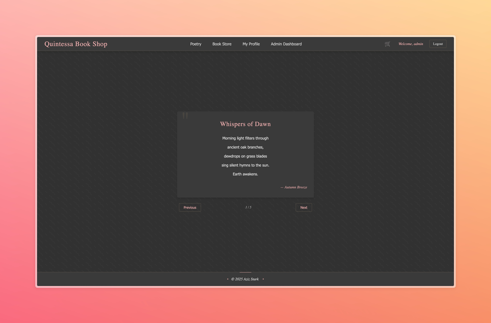
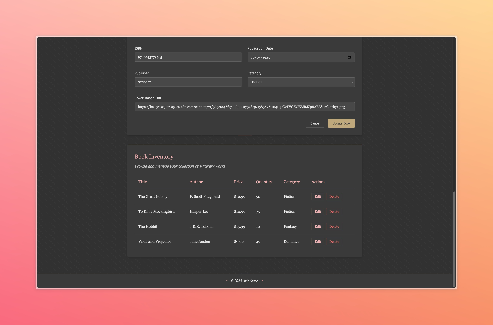

# MQSN Stack: Modern Full-Stack Application Demo

This project demonstrates a cutting-edge full-stack application architecture using the **MQSN stack** - a modern alternative to traditional MERN/MEAN stacks, designed for superior performance and developer experience.


## Application Screenshots

Here are some key views from the application that showcase the MQSN stack's capabilities:

<table>
  <tr>
    <td></td>
    <td></td>
  </tr>
  <tr>
    <td></td>
    <td></td>
  </tr>
</table>

## What is the MQSN Stack?

The MQSN stack represents:

- **M**: MongoDB - Flexible NoSQL document database
- **Q**: Quarkus - Supersonic Subatomic Java framework
- **S**: SolidJS - Fine-grained reactive UI framework
- **N**: Node.js - JavaScript runtime for tooling and development

## Tech Stack Details

### Backend Architecture
- **Framework**: [Quarkus 3.8.6.1](https://quarkus.io/)
  - Kubernetes-native Java framework optimized for container-first deployments
  - Up to 10x faster startup and 2x lower memory footprint compared to traditional Java frameworks
  - Hot reload for rapid development cycles

- **Database**: [MongoDB](https://www.mongodb.com/) with Quarkus Panache
  - NoSQL document database for flexible schema design
  - Object-Document mapping via MongoDB Panache
  - Scalable data storage solution

- **Security Implementation**:
  - JWT Authentication using SmallRye JWT
  - Password hashing with jBCrypt (0.4)
  - Role-based access control
  - API endpoint security

- **API Design**:
  - RESTEasy Reactive for non-blocking REST APIs
  - Jackson for JSON serialization/deserialization
  - Hibernate Validator for input validation
  - Reactive programming model for superior performance

### Frontend Architecture
- **Framework**: [SolidJS 1.9.5](https://www.solidjs.com/)
  - Fine-grained reactivity model with true reactivity (no Virtual DOM)
  - Up to 35% faster than React for common operations
  - Familiar React-like syntax with powerful primitives
  - Significantly smaller runtime (6.4KB vs React's 42KB min+gzip)

- **Router**: @solidjs/router 0.15.3
  - Declarative routing for SolidJS applications
  - Dynamic route handling and parameters

- **Build Tool**: [Vite 6.2.0](https://vitejs.dev/)
  - Lightning fast development server
  - Optimized production builds
  - Native ES modules support
  - Hot Module Replacement (HMR)

### Development Environment
- **Orchestration**: npm scripts with concurrently
  - Run backend and frontend simultaneously
  - Automated port management
  - Single command project startup

- **AI Components**:
  - FAISS (Facebook AI Similarity Search) integration
  - Vector-based search capabilities

## Why Choose MQSN Over Other Stacks?

| Feature | MQSN | MERN | MEAN |
|---------|------|------|------|
| Backend Performance | ★★★★★ (Quarkus) | ★★★☆☆ (Express) | ★★★☆☆ (Express) |
| Frontend Performance | ★★★★★ (SolidJS) | ★★★☆☆ (React) | ★★★☆☆ (Angular) |
| Memory Footprint | ★★★★☆ | ★★★☆☆ | ★★☆☆☆ |
| Startup Time | ★★★★★ | ★★★★☆ | ★★☆☆☆ |
| Developer Experience | ★★★★☆ | ★★★★☆ | ★★★☆☆ |
| Enterprise Readiness | ★★★★★ | ★★★☆☆ | ★★★★☆ |
| Bundle Size | ★★★★★ | ★★★☆☆ | ★★☆☆☆ |

## Featured Components

### User Authentication


The authentication system uses JWT tokens with public/private key signing for secure user management. The simple but effective forms are built with SolidJS's reactive primitives.

### Book Inventory Management



Administrators can manage the book inventory through an intuitive interface that demonstrates SolidJS's efficient DOM updates and Quarkus's reactive backend.

### Book Editing Form


The application includes forms for adding and editing books, showcasing SolidJS's form handling capabilities and seamless integration with the backend.

## Project Architecture

```
├── backend/                 # Quarkus backend
│   ├── src/                 # Source code
│   │   ├── main/
│   │   │   ├── java/       # Java backend code
│   │   │   │   └── org/example/
│   │   │   │       ├── dto/      # Data Transfer Objects
│   │   │   │       └── util/     # Utilities
│   │   │   └── resources/  # Configuration files
│   │   └── test/           # Test code
│   ├── pom.xml             # Maven dependencies
│   └── mvnw                # Maven wrapper
├── frontend/               # SolidJS frontend
│   ├── src/                # Source code
│   │   ├── components/     # Reusable components
│   │   ├── pages/          # Application pages
│   │   ├── store/          # State management
│   │   ├── App.jsx         # Main application component
│   │   └── index.jsx       # Entry point
│   ├── package.json        # NPM dependencies
│   └── vite.config.js      # Vite configuration
└── package.json            # Root package.json for scripts
```

## Core Features Demonstrated

- JWT-based authentication system
- User management with secure password handling
- Book and poem management APIs
- Shopping cart functionality
- Admin dashboard
- Protected routes
- RESTful API design
- MongoDB CRUD operations
- Reactive programming patterns

## Project Setup

### Prerequisites
- Java 11+
- Node.js 16+
- MongoDB 6.0+

### Installation Steps

1. **Clone the repository**
   ```bash
   git clone https://github.com/yourusername/mqsn-stack-demo.git
   cd mqsn-stack-demo
   ```

2. **Install dependencies**
   ```bash
   npm run install-deps
   ```

3. **Verify MongoDB connection**
   ```bash
   npm run mongo-status
   ```

4. **Start the application**
   ```bash
   npm run dev
   ```

   This command will:
   - Start the Quarkus backend on http://localhost:8081
   - Launch the SolidJS frontend on http://localhost:5173
   - Enable hot reloading for both frontend and backend

### Individual Component Startup

- **Frontend only**
  ```bash
  npm run frontend
  ```

- **Backend only**
  ```bash
  npm run backend
  ```

## Performance Advantages

### Backend (Quarkus)
- **Startup Time**: Under 1 second in dev mode, compared to 10+ seconds for Spring Boot
- **Memory Usage**: ~70MB for a typical application vs 200MB+ for traditional Java frameworks
- **Response Times**: Significantly lower latency for API responses
- **Native Compilation**: GraalVM native image support for containerized deployments

### Frontend (SolidJS)
- **Bundle Size**: 6.4KB min+gzip for runtime (vs React's 42KB)
- **Memory Usage**: Lower memory footprint due to no Virtual DOM
- **Rendering Performance**: Fine-grained updates with minimal DOM operations
- **Initial Load**: Faster parsing and execution time

## Development Workflow

The project structure supports an efficient development workflow:

1. Run `npm run dev` to start both frontend and backend
2. Backend changes are automatically hot-reloaded by Quarkus
3. Frontend changes are instantly reflected through Vite's HMR
4. MongoDB provides flexible data storage without schema migrations
5. JWT authentication enables stateless scaling

## Containerization

The project includes Docker configurations for:
- JVM mode deployment
- Native image deployment
- Multi-stage builds for optimized container sizes

## Conclusion

The MQSN stack represents a modern approach to full-stack development that balances performance, developer experience, and enterprise readiness. By combining the strengths of MongoDB, Quarkus, SolidJS, and Node.js, this stack provides an excellent foundation for building scalable, maintainable applications with exceptional performance characteristics.

---

*This project demonstrates the latest in full-stack development techniques and technology choices as of 2025.*
