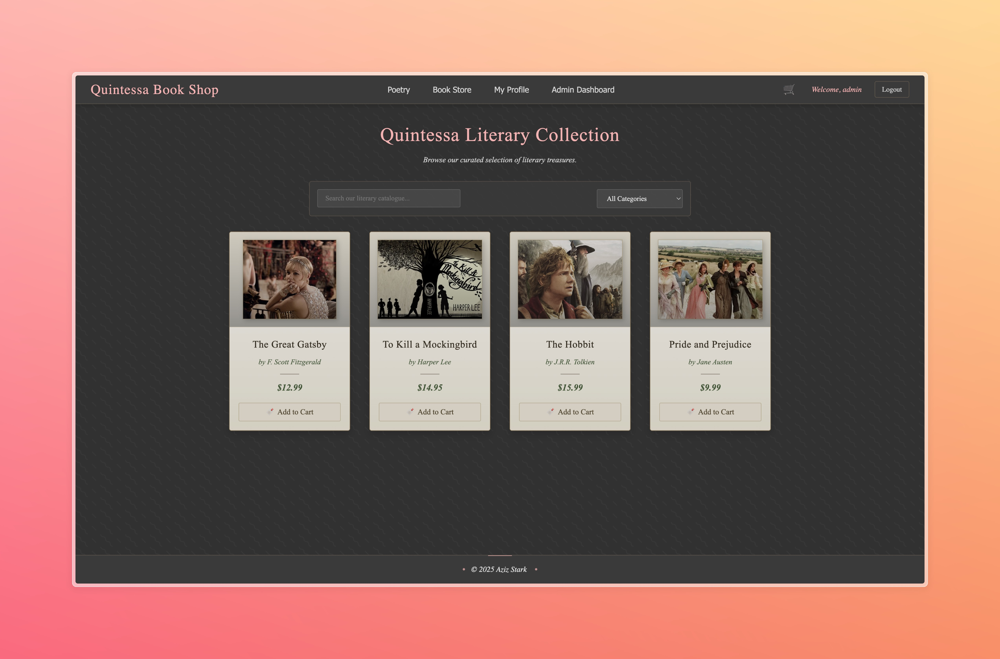
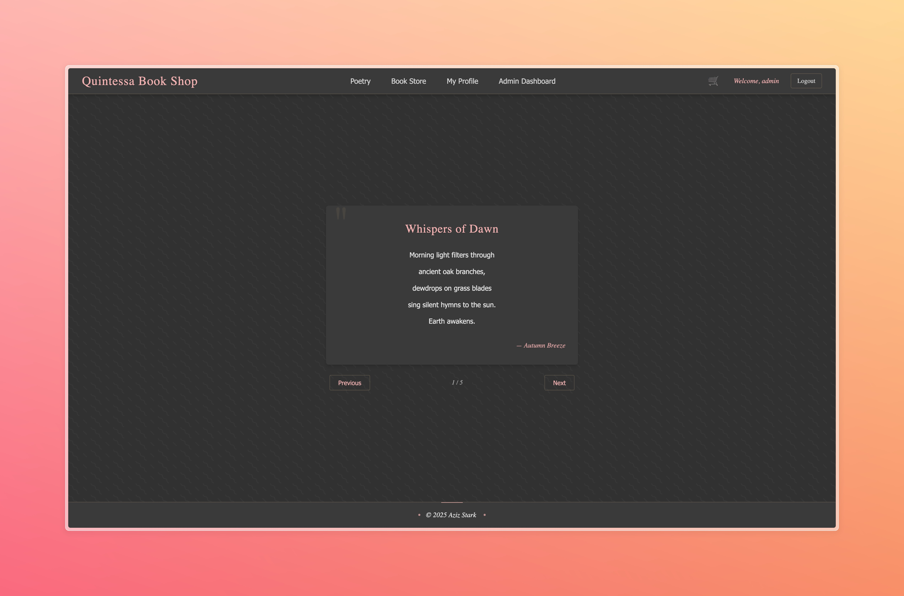
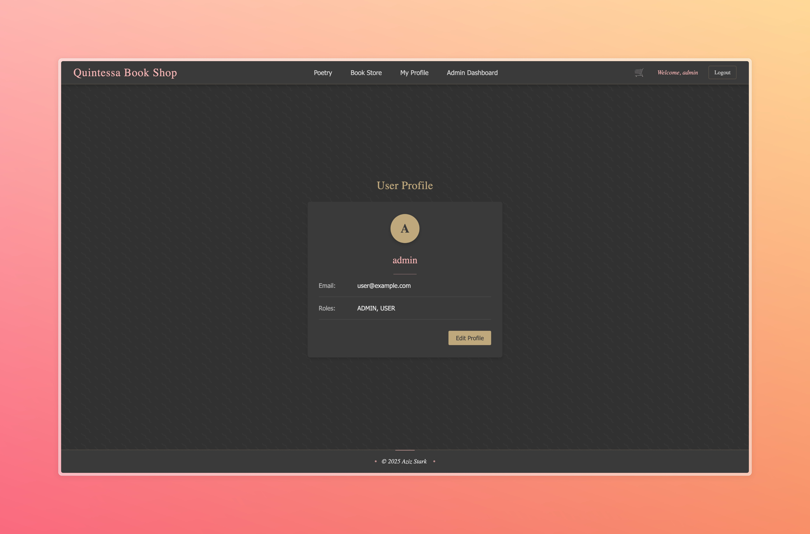
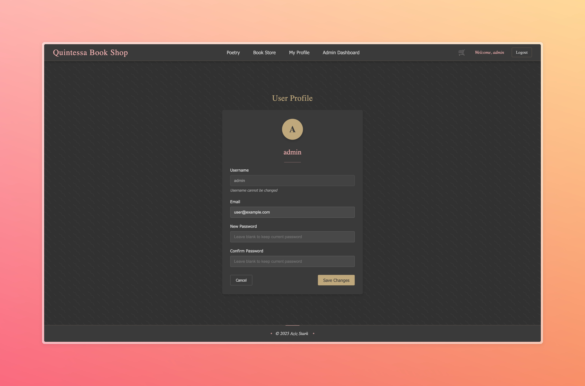
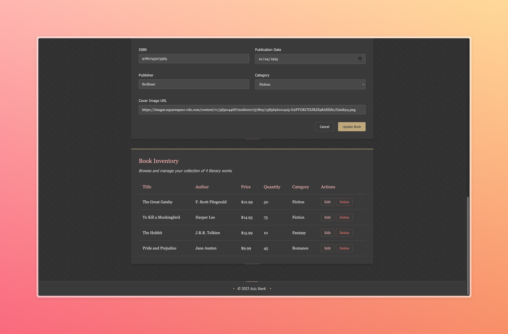

# MQSN Stack Frontend: SolidJS

This directory contains the frontend application for the MQSN stack demo, built with SolidJS and Vite.



## Technology Stack

### Core Framework
- **[SolidJS 1.9.5](https://www.solidjs.com/)** - Reactive JavaScript UI Library
  - Fine-grained reactivity with signals
  - No Virtual DOM for optimal performance
  - Efficient DOM updates with minimal overhead
  - Tiny runtime footprint (6.4KB min+gzip)

### Routing & Navigation
- **[@solidjs/router 0.15.3](https://github.com/solidjs/solid-router)** - Official SolidJS routing library
  - Declarative routing with nested routes
  - Route parameters and guards
  - Lazy-loaded components
  - Location API

### Build System
- **[Vite 6.2.0](https://vitejs.dev/)** - Next Generation Frontend Tooling
  - Lightning-fast dev server with HMR
  - ES modules for instantaneous updates
  - Optimized production builds
  - Rich plugin ecosystem

## Project Structure

```
src/
├── App.jsx                # Main application component
├── App.css                # Application styles
├── index.jsx              # Application entry point
├── index.css              # Global styles
├── assets/                # Static assets
├── components/            # Reusable components
│   ├── BookManagement.jsx # Admin book management
│   ├── Login.jsx          # Login form
│   ├── Navbar.jsx         # Navigation bar
│   ├── NotFound.jsx       # 404 page
│   ├── ProtectedRoute.jsx # Auth route protection
│   ├── Signup.jsx         # Signup form
│   └── Unauthorized.jsx   # Unauthorized access page
├── pages/                 # Application pages
│   ├── AdminDashboard.jsx # Admin dashboard
│   ├── BookStore.jsx      # Book store page
│   ├── PoemBrowser.jsx    # Poem browsing interface
│   ├── ShoppingCart.jsx   # Shopping cart
│   └── UserProfile.jsx    # User profile page
└── store/                 # State management
    └── authStore.js       # Authentication state
```

## Key Features

### Reactive State Management
The SolidJS frontend leverages signals for state management, providing several advantages:

```jsx
// Example of SolidJS reactivity
import { createSignal, createEffect } from "solid-js";

function Counter() {
  const [count, setCount] = createSignal(0);
  const [doubled, setDoubled] = createSignal(0);
  
  // Automatically updates when dependencies change
  createEffect(() => setDoubled(count() * 2));
  
  return (
    <div>
      <p>Count: {count()}</p>
      <p>Doubled: {doubled()}</p>
      <button onClick={() => setCount(c => c + 1)}>Increment</button>
    </div>
  );
}
```

### Component Architecture
SolidJS components use a React-like JSX syntax but with fundamental differences:

- Components are called once and not re-rendered
- Props are reactive without prop drilling issues
- Efficient updates that only affect what changed



### Authentication Flow
The application implements a JWT-based authentication flow:

1. User credentials sent to backend
2. JWT token received and stored
3. Token included in Authorization header for API calls
4. Protected routes check for valid token

<table>
  <tr>
    <td></td>
    <td></td>
  </tr>
</table>

### Routing Implementation

```jsx
// Example route configuration
<Routes>
  <Route path="/" component={Home} />
  <Route path="/books" component={BookStore} />
  <Route path="/poems" component={PoemBrowser} />
  <Route path="/cart" component={ShoppingCart} />
  <Route path="/profile" component={UserProfile} />
  <ProtectedRoute path="/admin" component={AdminDashboard} role="ADMIN" />
  <Route path="*" component={NotFound} />
</Routes>
```

## Performance Advantages

### Fine-grained Reactivity
SolidJS's reactivity system only updates the specific DOM nodes that need to change:

- No diffing or reconciliation needed
- No component re-rendering
- Minimal memory overhead

### Bundle Size
The minimalistic approach of SolidJS results in extremely small bundle sizes:

- Core runtime: just 6.4KB min+gzip (vs React's 42KB)
- No need for additional state management libraries
- Tree-shakable imports

### Rendering Efficiency
Performance benchmarks consistently show SolidJS outperforming other frameworks:

- Up to 35% faster than React for common operations
- Minimal memory churn
- Low GC pressure
- Optimal CPU utilization



**Real-world Example:** The inventory management interface shown above renders book items with fine-grained reactivity, updating only the specific DOM nodes that change when items are modified.

## Development Workflow

### Getting Started
```bash
# Install dependencies
npm install

# Start development server
npm run dev
```

This will start a Vite development server at http://localhost:5173 with hot module replacement.

### Building for Production
```bash
npm run build
```

This creates optimized static files in the `dist` directory, ready for deployment.

### Preview Production Build
```bash
npm run preview
```

This serves the production build locally for testing.

## State Management

The application uses SolidJS's built-in primitives for state management:

### Signals
For reactive variables that trigger updates when changed:

```jsx
const [count, setCount] = createSignal(0);
```

### Stores
For more complex state shared across components:

```jsx
const [authState, setAuthState] = createStore({
  user: null,
  token: null,
  isAuthenticated: false
});
```

### Effects
For side effects and derived state:

```jsx
createEffect(() => {
  if (authState.token) {
    localStorage.setItem('token', authState.token);
  }
});
```

## Integration with Backend

### API Communication
The frontend communicates with the Quarkus backend:

```js
// Example API call
async function fetchBooks() {
  const response = await fetch('http://localhost:8081/api/books', {
    headers: {
      'Authorization': `Bearer ${authState.token}`
    }
  });
  return response.json();
}
```

### Authentication
JWT tokens received from the backend are stored and included in API requests.

### CORS Configuration
The frontend works with the backend's CORS configuration to ensure secure cross-origin communication.

## Key Technical Advantages

1. **Minimal Re-renders**: Only the specific DOM nodes that need to change are updated
2. **Tiny Runtime**: Fraction of the size of other frameworks
3. **Familiar Syntax**: JSX that feels like React but with true reactivity
4. **Fast Development**: Vite enables instant feedback during development
5. **Efficient DOM Updates**: No intermediate representations (like Virtual DOM)
6. **Type Safety**: Full TypeScript support

This frontend application demonstrates the power of the SolidJS framework as part of the MQSN stack, providing exceptional performance and developer experience.
